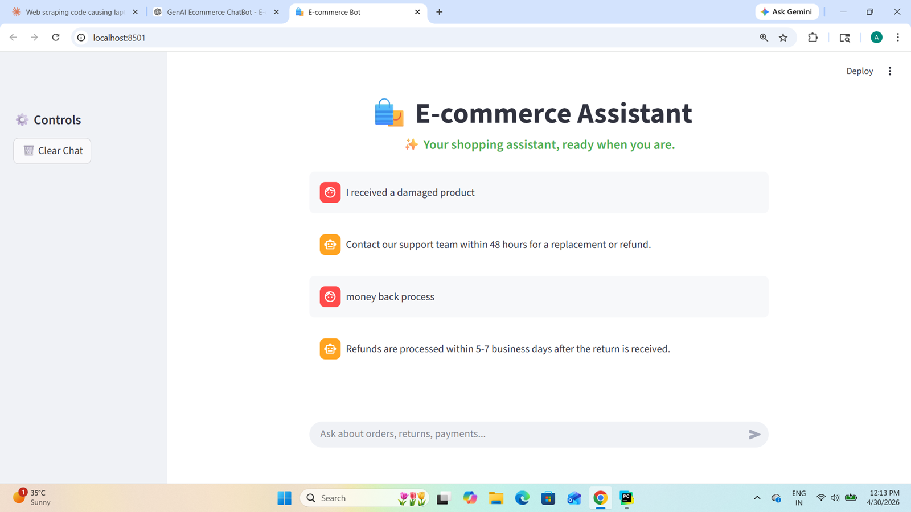
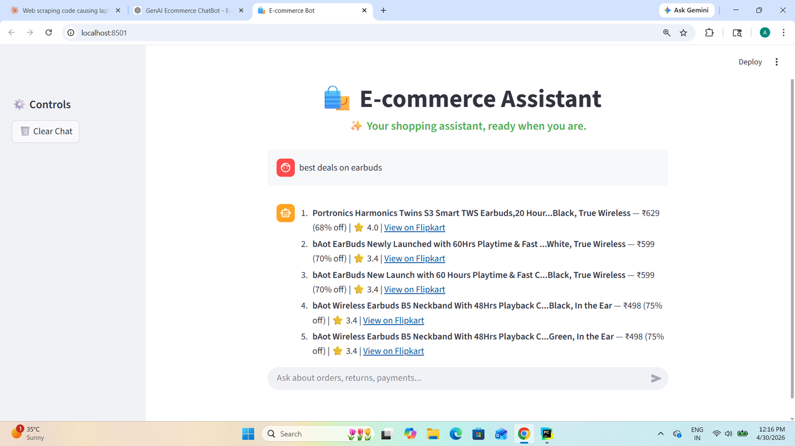

# 🛍️ E-Commerce AI Chatbot

<div align="center">


<br/>


<br/>

### 🔗 Connect & Explore

[](https://github.com/AditiPatil31)
[](https://www.linkedin.com/in/aditi-patil31/)
[](https://aditi-ecommerce-ai-chatbot.streamlit.app/)

<br/>

> **Ask anything. Get real products. Instantly.**
> *Hybrid LLM + SQL + RAG powered shopping assistant*

</div>

---

## 🧠 What Makes This Different?

Most chatbots rely on either **RAG** (for FAQs) or **SQL** (for product retrieval).

This project combines both using an **intelligent routing layer** that understands user intent before deciding how to answer.

| Query Type      | Example                    | Handled By             |
| --------------- | -------------------------- | ---------------------- |
| Product Search  | "budget laptops under 40k" | LLM → SQL → SQLite     |
| FAQ             | "What is return policy?"   | RAG → ChromaDB         |
| Mixed Query     | "how to track my product"  | FAQ (correctly routed) |
| Unknown Product | "show me gucci bags"       | SQL fallback           |

---

## 🧠 Intelligent Routing System

Instead of relying on a single method, the chatbot uses a **layered decision system** to reduce errors and improve accuracy.

```
User Query
   ↓
Semantic Understanding
   ↓
FAQ Safety Check
   ↓
Database Matching
   ↓
Intent Detection
   ↓
Final Route → FAQ or SQL
```

### How it works

* The system first tries to **understand the meaning** of the query using a semantic model
* If the query clearly looks like a support/FAQ question, it is handled by the **RAG pipeline**
* If not, it checks whether the query matches **real products in the database**
* If no match is found, it falls back to **intent detection** to still handle shopping queries

This layered approach helps handle tricky cases like:

* "how to track my product" → correctly treated as FAQ
* "show me gucci bags" → treated as product search even if not in database

---

## 🏗️ Architecture

```
User Query
   ↓
Hybrid Router (semantic + DB + intent)
   ↓
FAQ (RAG)        Product Search (SQL + LLM)
   ↓                    ↓
ChromaDB          Query Preprocessing
                   ↓
                LLM → SQL
                   ↓
                SQLite DB
                   ↓
                Fallback Search
                   ↓
                Final Response
```

---

## ⚙️ Key Features

* 🔹 Intelligent hybrid routing system
* 🔹 Handles **ambiguous and mixed queries reliably**
* 🔹 RAG-based FAQ answering (ChromaDB)
* 🔹 LLM-powered SQL generation
* 🔹 Database-driven product detection (no hardcoding)
* 🔹 Smart query preprocessing:

  * `50k → 50000`
  * category mapping (phones → smartphones)
  * adjective → SQL hints
* 🔹 Robust fallback search (title + brand + category)
* 🔹 Safe SQL execution (SELECT-only)
* 🔹 Dynamic LIMIT handling
* 🔹 Clean product output with links

---

## 📸 Screenshots

### 💬 Chat Interface



### 🛒 Product Results



---

## 🛠️ Tech Stack

* **Frontend:** Streamlit
* **LLM:** Groq (LLaMA3)
* **Database:** SQLite
* **Vector DB:** ChromaDB
* **Embeddings:** Sentence Transformers
* **Language:** Python

---

## 🚀 Run Locally

```bash
git clone https://github.com/AditiPatil31/YOUR_REPO
cd YOUR_REPO

python -m venv venv
venv\Scripts\activate

pip install -r requirements.txt
streamlit run main.py
```

---

## 🎯 Sample Queries

```
show me budget friendly headphones
top rated samsung phones under 20000
popular smartwatches
NOVA hair dryer
heavily discounted TVs

how to track my order
money back process
cancel my order
```

---

## 📌 Why This Project Stands Out

* Combines **semantic understanding + rule-based safety + database grounding**
* Reduces common chatbot failures (wrong routing, mixed queries)
* Automatically adapts to **new products added to the database**
* Designed with **real-world edge cases in mind**

---

<div align="center">

## 👩‍💻 Author

**Aditi Patil**

[](https://www.linkedin.com/in/aditi-patil31/)
[](https://github.com/AditiPatil31)

<br/>

⭐ **If you like this project, consider giving it a star!**

</div>
